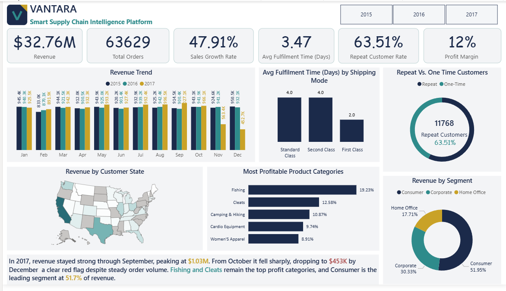

# Vantara — Smart Supply Chain Intelligence Platform

**End-to-end Business Analytics project** analyzing 180,519 supply chain orders to uncover revenue, delivery, and customer risks — built with `Python`, `PostgreSQL`, `SQL`, `Excel`, and `Power BI`.

> 📉 Found a 56% revenue drop hiding behind rising order volume. 🚚 Found the "fastest" shipping option was actually the least reliable. 🔁 Verified true customer loyalty independently across three tools. Full story below.



---

## Table of Contents

- [Business Problem & Dataset](#business-problem--dataset)
- [Tools & Technologies](#tools--technologies)
- [Project Structure](#project-structure)
- [Key Insights & Visuals](#key-insights--visuals)
- [How to Run](#how-to-run)
- [Future Work](#future-work)
- [Contact](#contact)

---

## Business Problem & Dataset

Vantara's order volume kept growing year over year, but leadership couldn't tell if that growth was actually turning into profit, reliable delivery, or loyal customers. As Business Analyst, I was asked to dig into the order data and answer:

> **"Where is the business losing money and customers — and what should be done about it?"**

**Dataset:** [DataCo Smart Supply Chain for Big Data Analysis](https://www.kaggle.com/datasets/shashwatwork/dataco-smart-supply-chain-for-big-data-analysis) (Kaggle) — 180,519 order-line records, 53 columns, covering orders, customers, products, shipping, and payments from 2015–2018.

---

## Tools & Technologies

| Category | Tools |
|---|---|
| Data Cleaning | Python (Pandas), Jupyter Notebook |
| Database | PostgreSQL (star schema: 1 fact + 4 dimension tables) |
| Analysis | SQL (joins, CTEs, aggregations) |
| Modeling | Excel (Pivot Tables, Power Pivot, scenario modeling) |
| Visualization | Power BI (DAX measures, custom brand theme) |
| Documentation | BRD, Decisions Log, Findings & Recommendations Report |

---

## Project Structure

```
Vantara-Smart-Supply-Chain-Intelligence-Platform/
│
├── Dashboard/             → Power BI files (.pbix, .pbit) + exported PDF
├── Data/
│   ├── Raw/                  → Original source CSV
│   └── clean/                → Cleaned fact + dimension tables
│   └── Vantara_Analysis_Model.xlsx   → Excel pivot model & scenario analysis
├── Database/               → PostgreSQL schema + setup
├── Documentation/           → BRD, Decisions Log, Findings & Recommendations, Presentation
├── Notebook/               → Python data cleaning pipeline (Jupyter)
├── SQL_Analysis/             → Analysis queries (revenue, profit, delivery, customers)
├── Screenshots/             → Dashboard preview images
└── LICENSE
```

---

## Key Insights & Visuals

### 📉 Revenue dropped 56% in Q4 2017 — while order volume rose
Revenue held a steady $900K–$1M/month rhythm through September 2017, then fell to $452.7K by December, despite order count actually *increasing* in that window — a sign of a pricing or data issue, not falling demand.

### 🚚 55% of all orders arrive late — and the premium option is worst
First Class shipping (the option customers pay more for) has a **95%** late-delivery rate, far above Standard Class at 38%. This points to a fulfilment capacity problem across the board, not one weak carrier.

| Delivery Performance | Customer Insights |
|---|---|
|  |  |

### 🔁 63.51% repeat customer rate — verified, not assumed
An initial reference estimate of 76% was recalculated independently in SQL, DAX, and Excel — all three agreed on the real number. Lifetime value is nearly equal (~$1.6K) across all customer segments; Consumer's revenue lead comes from volume, not higher spend.

### 💰 Two categories drive nearly a third of all profit
Fishing and Cleats alone account for ~32% of total profit, while several categories barely contribute — a clear signal for where to focus inventory and marketing.

📄 Full findings: [`Documentation/Vantara_Findings_and_Recommendations.docx`](Documentation/)
📄 Every data decision explained: [`Documentation/Vantara_Decisions_Log.docx`](Documentation/)

---

## How to Run

1. **Clone the repo**
   ```bash
   git clone https://github.com/seema-kri/Vantara-Smart-Supply-Chain-Intelligence-Platform.git
   ```
2. **Data cleaning** — open `Notebook/Data_Preparation.ipynb` in Jupyter and run all cells (source CSV linked above) to regenerate the cleaned tables in `Data/clean`.
3. **Database** — run the schema script in `Database/` against a PostgreSQL instance, then load the cleaned CSVs from `Data/clean` in this order: customers → products → location → date → fact_orders.
4. **SQL analysis** — run the queries in `SQL_Analysis/Vantara_Analysis_Queries.sql` against the database.
5. **Excel model** — open `Data/Vantara_Analysis_Model.xlsx` (Excel, Data → Refresh All if reconnected to a live source).
6. **Dashboard** — open `Dashboard/Vantara_Supply_Chain_Dashboard.pbix` in Power BI Desktop; apply the custom theme if needed.

---

## Future Work

- Add marketing spend / CAC data to extend ROI analysis
- Automate the Python → PostgreSQL pipeline with a scheduled script
- Publish the dashboard to Power BI Service for live web access
- Extend analysis with a second project covering SaaS churn and revenue operations

---

## Contact

**Seema Kumari** 
📧 kriseema87@gmail.com · 🔗 [LinkedIn](https://linkedin.com/in/seema-kumari-375763308/) · 💻 [GitHub](https://github.com/seema-kri)

⭐ If this project was useful or interesting, consider starring the repo!
