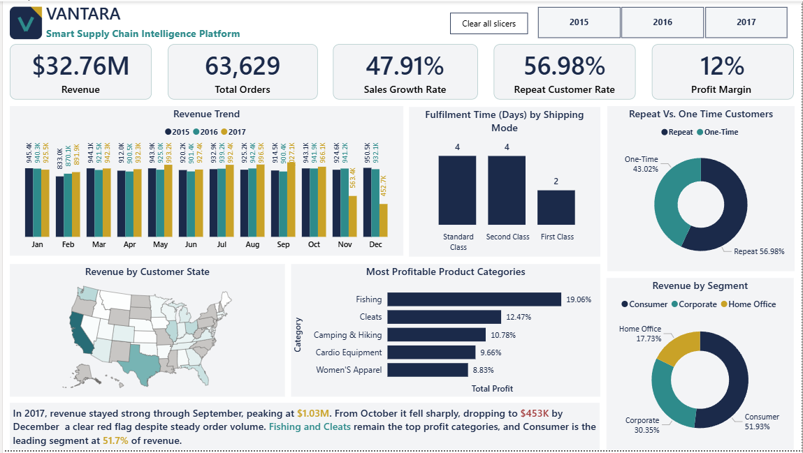

# Vantara — Smart Supply Chain Intelligence Platform

**A full-stack analytics case study: 180,519 order-line records → an executive Power BI dashboard, uncovering a hidden revenue collapse, a broken premium-shipping promise, and the true, verified customer loyalty rate.**


📄 [BRD](Documentation/BRD.pdf) · 📊 [SQL Findings](Documentation/SQL_Business_Question_Analysis.pdf) · 📑 [Full Report](Documentation/Vantara_Findings_and_Recommendations.docx) · 📋 [Decisions Log](Documentation/Vantara_Decisions_Log.docx) · 📽️ [Presentation](Documentation/Presentation.pdf)



---

## The Question

Vantara's order volume kept growing year over year, but leadership had no clear view of whether that growth was translating into profit, reliable delivery, or real customer loyalty. Task:

> **"Where is the business losing money and customers, and what should be done about it?"**

**Dataset:** [DataCo Smart Supply Chain](https://www.kaggle.com/datasets/shashwatwork/dataco-smart-supply-chain-for-big-data-analysis) (Kaggle) · 180,519 order-line records · 2015–2017

## What I Found

| Question | Answer | Impact |
|---|---|---|
| Is revenue growth real? | No — Q4 2017 revenue fell **-56% MoM** ($1.03M → $453K) while order volume rose | Points to a pricing/discounting or data-integrity failure, not falling demand |
| Which shipping is best? | **First Class** (the premium option) has a **95% late-delivery rate** — worse than Standard | The service customers pay extra for is the least reliable one |
| How loyal are customers? | **56.98% repeat rate**, independently verified in SQL, DAX, and Excel against an unverified 76% reference figure | The "true north" loyalty KPI leadership can actually trust |
| Where's the profit? | **Fishing + Cleats ≈ 32%** of total profit | Tells leadership exactly where to defend margin |
| Is the map honest? | No — global markets (England, Isle of France) lead by revenue, but the dashboard's U.S.-only map hides them | The business is more international than it looks |


## Beyond the Dashboard: 10 SQL Investigations

Ten window-function queries (ranking, running totals, moving averages, quartiles, lag/lead) went past the headline KPIs to stress-test the dashboard itself. Full write-up: **[SQL_Business_Question_Analysis.pdf](Documentation/SQL_Business_Question_Analysis.pdf)**

Four issues flagged for fix before the next stakeholder review:
- **Sales Growth Rate card is misleading.** MoM swings are volatile (-11.85% → +13.40% in one quarter), but the dashboard shows one flat number.
- **Repeat-customer logic — verified.** Order-sequence method confirms the 56.98% figure is built on sound logic.
- **Revenue map hides global markets.** Location data spans international markets; the visual only renders U.S. states.
- **Late-delivery counts don't reconcile.** SQL shows 54.83% of order-lines are late (98,977 of ~180,519) — doesn't match the dashboard's 36.0K, revealing an order-line vs. distinct-order grain mismatch.

## Executive KPIs

| Metric | Value |
|---|---|
| Total Revenue | $32.76M |
| Total Orders | 63,629 |
| Repeat Customer Rate | 56.98% |
| Avg. Fulfilment Time | 3.47 days |
| Profit Margin | 12% |
| Late Delivery Rate | 54.83% |

## Recommendations

1. **Investigate the Q4 2017 collapse** — audit pricing, promotions, and data capture for that window.
2. **Fix premium shipping** — rework First Class SLAs and capacity so it reflects an actual premium service.
3. **Fix the revenue map's scope** — switch to a world view or add a market filter.
4. **Reconcile delivery-status counting** across SQL and DAX to a single grain.
5. **Protect the high-profit core** — prioritize inventory and marketing on Fishing and Cleats.
6. **Track repeat rate as an executive KPI**, segmented by region and customer type, to catch churn early.

## How It Was Built

| Layer | Tools |
|---|---|
| Cleaning | Python (Pandas), Jupyter |
| Database | PostgreSQL — star schema (1 fact + 4 dimension tables) |
| Analysis | SQL — joins, CTEs, window functions |
| Cross-check | Excel — independent pivot validation of every headline metric |
| Visualization | Power BI — DAX measures, branded 3-page dashboard |

Process: **BRD → Python cleaning → PostgreSQL star schema → SQL analysis → Excel cross-check → Power BI dashboard → written findings**, with every judgment call logged in the Decisions Log.

## Repo Structure

```
Vantara-Smart-Supply-Chain-Intelligence-Platform/
├── Dashboard/         → .pbix, PDF export, screenshots
├── Data/               → raw + cleaned tables, Excel model
├── Database/          → schema.sql, load scripts
├── Documentation/     → BRD, SQL findings, decisions log, presentation
├── Notebook/           → Data_Preparation.ipynb
├── SQL_Analysis/      → Vantara_Analysis_Queries.sql
└── Screenshots/
```

## How to Run

1. `git clone https://github.com/seema-kri/Vantara-Smart-Supply-Chain-Intelligence-Platform.git`
2. Read `Documentation/BRD.pdf` for scope and success criteria.
3. Run `Notebook/Data_Preparation.ipynb` to regenerate cleaned tables.
4. Load `Database/Vantara_Database_Schema.sql` into PostgreSQL, then load cleaned CSVs (`customers → products → location → date → fact_orders`).
5. Run `SQL_Analysis/Vantara_Analysis_Queries.sql` against the database.
6. Open `Data/Vantara_Analysis_Model.xlsx` and refresh.
7. Open `Dashboard/Vantara_Supply_Chain_Dashboard.pbix` in Power BI Desktop.

## How I Used AI

Used an AI assistant to scaffold starter SQL, draft initial Python cleaning code, and suggest DAX/dashboard layout ideas — then reviewed, corrected, and independently re-verified every number across SQL, DAX, and Excel before trusting it. Where SQL and the dashboard disagreed (e.g. late-delivery counts), the mismatch was documented, not smoothed over.

## Skills Demonstrated

End-to-end pipeline ownership · relational database design · advanced SQL (window functions, CTEs) · cross-tool KPI validation · requirements discipline (BRD-first) · executive communication · transparent AI-assisted workflow.

## Contact

**Seema Kumari** — Business Analyst
📧 [kriseema87@gmail.com](mailto:kriseema87@gmail.com) · 💼 [LinkedIn](https://linkedin.com/in/seema-kumari-375763308) · 💻 [GitHub](https://github.com/seema-kri)

---
⭐ If this project was useful, a star on the repo is appreciated.
